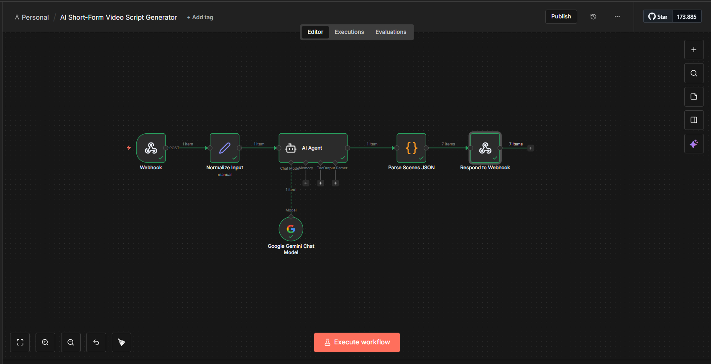

# AI Video Script Generator (n8n)

This repository contains an n8n workflow that generates structured,
scene-based video scripts using an AI agent and webhook input.

## Features
- Webhook-based API
- AI-generated video scripts
- Scene timestamps
- B-roll search prompts
- Clean JSON output

## Workflow Nodes
- Webhook
- Normalize Input
- AI Agent
- Parser
- Respond to Webhook

## Use Cases
- YouTube automation
- Short-form video creation
- Content pipelines
- AI video editing workflows

## How to Use
1. Import the JSON file into n8n
2. Activate the workflow
3. Call the webhook endpoint with a prompt
4. Receive structured video script JSON

## Workflow Preview

